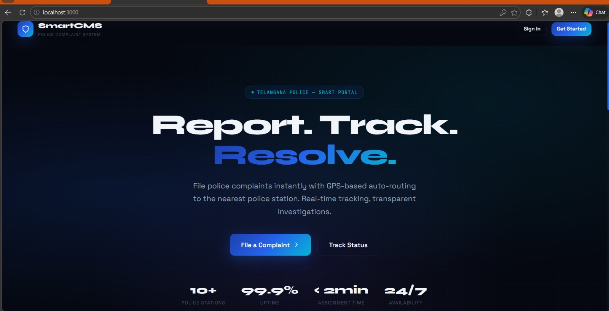
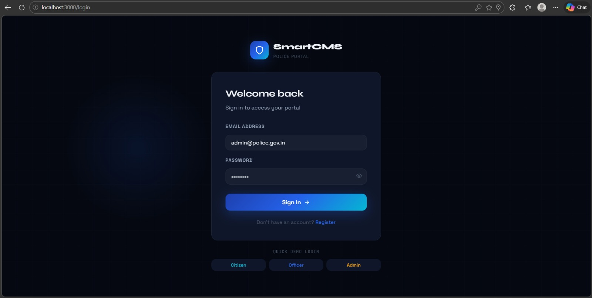
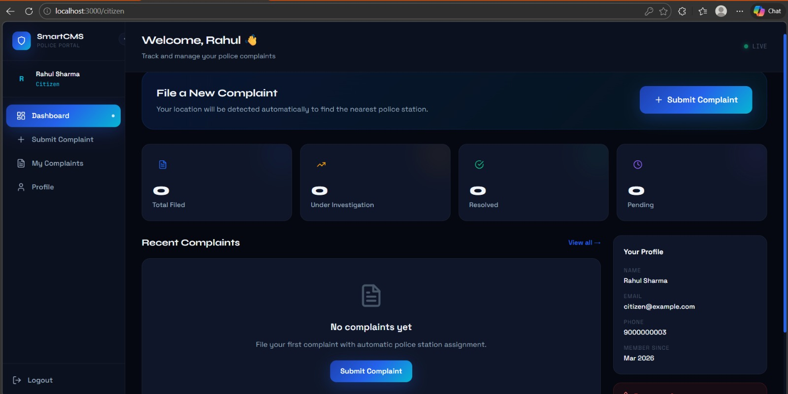
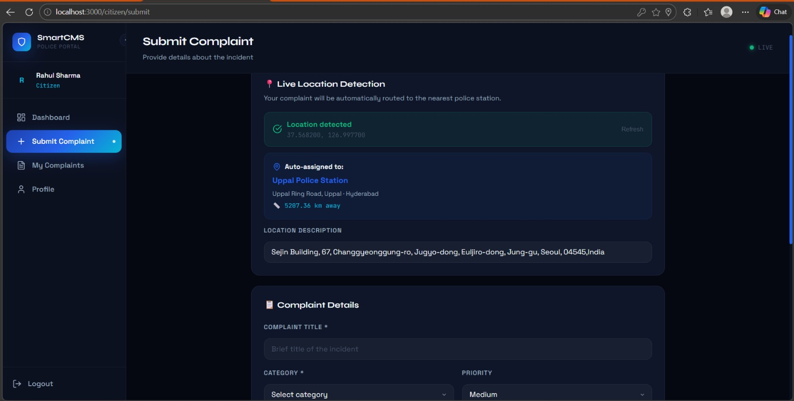
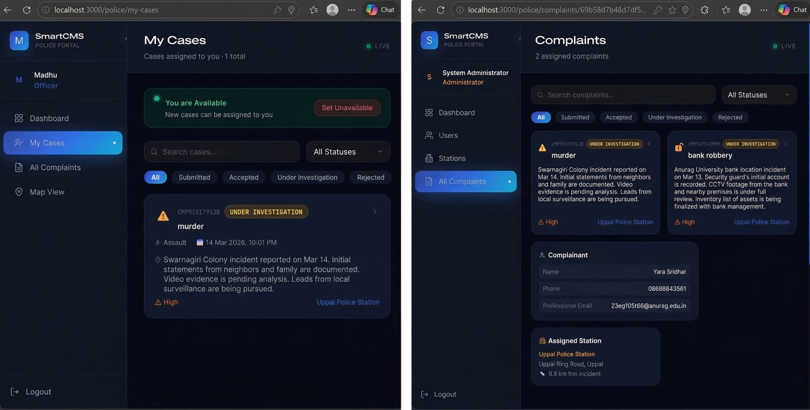
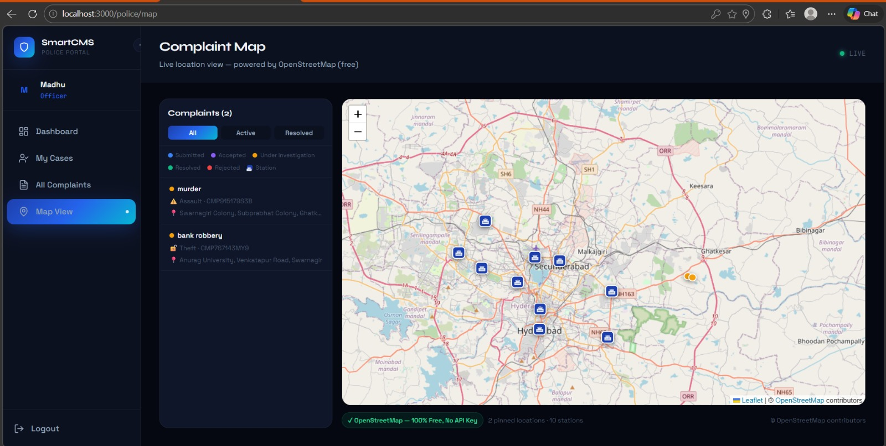

# 🚔 Smart Police Complaint Management System

A full-stack web application for filing, tracking, and managing police complaints with automatic GPS-based routing to the nearest police station.

---

## 🏗️ Tech Stack

| Layer | Technology |
|-------|-----------|
| Frontend | React 18, React Router v6, Recharts, Framer Motion |
| Backend | Node.js, Express.js |
| Database | MongoDB Atlas |
| Auth | JWT (JSON Web Tokens) |
| Maps | Google Maps API + Geolocation API |
| Styling | Pure CSS with CSS Variables (no UI framework) |

---
## 📸 Screenshots

### 🏠 Landing Page

Modern landing interface showcasing the platform’s core features — report, track, and resolve incidents efficiently.


---

### 🔐 Login Page

Secure authentication system supporting role-based access for citizens, officers, and administrators.


---

### 👤 Citizen Dashboard

User dashboard for tracking submitted complaints, viewing status updates, and managing reports.


---

### 📝 Submit Complaint

Complaint submission with live GPS-based location detection and automatic assignment to the nearest police station.


---

### 👮 Role-Based Case Management

Integrated admin and officer interface demonstrating case assignment, investigation tracking, and detailed complaint handling.


---

### 🗺️ Map View

Interactive map visualization displaying real-time complaint locations and police station coverage.



## 📁 Project Structure

```
smart-police-cms/
├── backend/
│   ├── models/
│   │   ├── User.js           # Citizen/Police/Admin user schema
│   │   ├── PoliceStation.js  # Station with GeoJSON location
│   │   └── Complaint.js      # Complaint with status history
│   ├── routes/
│   │   ├── auth.js           # Register, login, profile
│   │   ├── complaints.js     # CRUD + nearest station assignment
│   │   ├── stations.js       # Station management + nearest finder
│   │   ├── police.js         # Police dashboard + officers
│   │   └── admin.js          # Admin management
│   ├── middleware/
│   │   └── auth.js           # JWT + role-based access control
│   ├── utils/
│   │   ├── distance.js       # Haversine distance algorithm
│   │   └── seeder.js         # Seeds 10 Hyderabad stations + demo users
│   └── server.js
├── frontend/
│   └── src/
│       ├── context/AuthContext.js
│       ├── utils/
│       │   ├── api.js         # Axios instance with interceptors
│       │   └── helpers.js     # Date, status, category helpers
│       ├── components/shared/
│       │   ├── Layout.js      # Main layout with collapsible sidebar
│       │   ├── Sidebar.js     # Role-aware navigation
│       │   ├── StatCard.js    # Dashboard stat cards
│       │   └── ComplaintCard.js
│       └── pages/
│           ├── LandingPage.js
│           ├── LoginPage.js
│           ├── RegisterPage.js
│           ├── citizen/       # Dashboard, Submit, List, Detail, Profile
│           ├── police/        # Dashboard, Complaints, Detail, Map
│           └── admin/         # Dashboard, Users, Stations
└── README.md
```

---

## 🚀 Setup Instructions

### Prerequisites
- Node.js 18+
- MongoDB Atlas account (free tier works)
- Google Maps API Key (optional — falls back to table view)

### 1. Clone & Install

```bash
# Install backend dependencies
cd backend
npm install

# Install frontend dependencies
cd ../frontend
npm install
```

### 2. Configure Environment Variables

**Backend** — copy `backend/.env.example` to `backend/.env`:

```env
MONGODB_URI=mongodb+srv://<user>:<pass>@cluster0.xxxxx.mongodb.net/smart-police-cms
JWT_SECRET=your_super_secret_key_minimum_32_chars
PORT=5000
FRONTEND_URL=http://localhost:3000
```

**Frontend** — copy `frontend/.env.example` to `frontend/.env`:

```env
REACT_APP_API_URL=http://localhost:5000/api
REACT_APP_GOOGLE_MAPS_API_KEY=your_google_maps_key_here
```

### 3. MongoDB Atlas Setup

1. Go to [mongodb.com/cloud/atlas](https://mongodb.com/cloud/atlas)
2. Create a free cluster
3. Add a database user
4. Whitelist your IP (or `0.0.0.0/0` for development)
5. Copy the connection string to `MONGODB_URI`

### 4. Run the App

**Terminal 1 — Backend:**
```bash
cd backend
npm run dev
# Server starts at http://localhost:5000
# Database seeds automatically on first run
```

**Terminal 2 — Frontend:**
```bash
cd frontend
npm start
# App opens at http://localhost:3000
```

---

## 👥 Demo Accounts (auto-seeded)

| Role | Email | Password |
|------|-------|----------|
| Citizen | citizen@example.com | Citizen@123 |
| Police Officer | officer@jh.police.gov.in | Officer@123 |
| Administrator | admin@police.gov.in | Admin@123 |

---

## 🔑 Key API Endpoints

### Auth
| Method | Endpoint | Description |
|--------|----------|-------------|
| POST | `/api/auth/register` | Register citizen |
| POST | `/api/auth/login` | Login (all roles) |
| GET | `/api/auth/me` | Get current user |
| PUT | `/api/auth/profile` | Update profile |

### Complaints
| Method | Endpoint | Description |
|--------|----------|-------------|
| POST | `/api/complaints` | Submit complaint (auto-assigns station) |
| GET | `/api/complaints/my` | Get citizen's complaints |
| GET | `/api/complaints/station/assigned` | Get station's complaints |
| GET | `/api/complaints/:id` | Get complaint details |
| PUT | `/api/complaints/:id/status` | Update status (police) |
| GET | `/api/complaints/stats/summary` | Get stats |

### Stations
| Method | Endpoint | Description |
|--------|----------|-------------|
| GET | `/api/stations` | Get all stations |
| POST | `/api/stations/nearest` | Find nearest station by coordinates |
| POST | `/api/stations` | Create station (admin) |

---

## 🧭 Core Algorithm: Nearest Station Routing

```
User submits complaint with GPS coordinates (lat, lon)
         ↓
Backend fetches all active police stations from MongoDB
         ↓
Haversine formula calculates distance to every station:
   d = 2R × arcsin(√(sin²(Δlat/2) + cos(lat1)·cos(lat2)·sin²(Δlon/2)))
         ↓
Station with minimum distance is selected
         ↓
Complaint auto-assigned to nearest station
         ↓
Police dashboard immediately shows new complaint
```

---

## 🎨 Design System

- **Font Display:** Syne (headings)
- **Font Body:** Space Grotesk (text)
- **Font Mono:** JetBrains Mono (IDs, data)
- **Theme:** Deep dark with electric blue accents
- **Color Palette:** Navy background (`#050810`) with `#2563eb` blue, `#06b6d4` cyan, `#f59e0b` gold
- **Sidebar:** Collapsible, role-aware navigation
- **Grid:** Responsive CSS Grid throughout

---

## 📊 Role Capabilities

### 🧑 Citizen
- Register and login
- Submit complaints with live GPS detection
- Upload evidence (images/documents)
- Track complaint status in real-time
- View detailed timeline with officer notes
- Submit anonymously

### 👮 Police Officer
- View all complaints assigned to their station
- Filter by status and category
- Update complaint status with comments
- View incident location and get route via Google Maps
- Add investigation notes and resolution summary

### 🛡️ Administrator
- Full system overview dashboard
- Create/manage police officers
- Manage police stations
- View and activate/deactivate users
- Monitor station performance metrics

---

## 🗺️ Google Maps Setup

1. Go to [Google Cloud Console](https://console.cloud.google.com)
2. Create a project → Enable **Maps JavaScript API**
3. Create an API key → Add to `frontend/.env`
4. Restrict the key to your domain in production

**Without a key:** The map page displays a fallback table view of complaint coordinates.

---

## 🛡️ Security Features

- **JWT Authentication** with 7-day expiry
- **Role-based access control** (citizen / police / admin)
- **Password hashing** with bcryptjs (12 rounds)
- **CORS** configured for frontend origin only
- **Anonymous complaints** — citizen identity hidden from officers
- **File upload limits** — 10MB per file, max 5 files

---

## 🔧 Production Deployment

### Backend (Railway / Render / Heroku)
```bash
# Set environment variables in dashboard
# Deploy from GitHub or CLI
npm start
```

### Frontend (Vercel / Netlify)
```bash
npm run build
# Deploy /build folder
# Set REACT_APP_API_URL to your deployed backend URL
```
